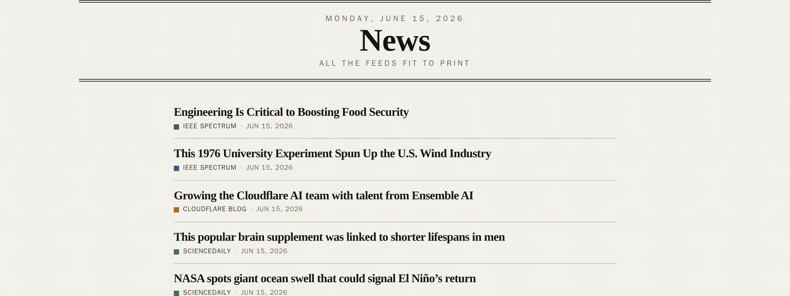

# news

**A personal news aggregator that pulls primary sources — company newsrooms,
investor-relations feeds, SEC filings, and science — into one fresh, fast feed.**

▶ **Live:** [news.cuteteal.com](https://news.cuteteal.com)



## What this is

A single-user news aggregator built for one reader, and a working portfolio
piece. It skips the engagement-optimized middlemen and reads primary sources
directly: tech-company newsrooms (Apple, NVIDIA, Intel, AMD, Qualcomm, Cisco, …),
investor-relations and earnings feeds, SEC EDGAR 8-K filings, and science wires —
all rendered server-side as a clean, newspaper-styled feed.

It runs entirely on Cloudflare's edge, and — notably — it's built almost entirely
by AI coding agents working a disciplined, test-gated workflow.

## Highlights

- **Astro 6 SSR on Cloudflare Workers**, with local dev running inside
  **workerd** for real production parity.
- **Multi-source ingestion** into D1 — RSS/Atom, JSON APIs, and SEC EDGAR —
  normalized into one feed; sessions and auth on KV.
- **100% line + branch coverage gate**, enforced and **hermetic** — the test
  suite never touches the network.
- **CI deploys on merge** — branch → PR → green checks → merge → live.

## 🤖 Built by AI coding agents

This repo is also an experiment in agent-driven development: nearly every change
ships through AI agents operating a real engineering workflow.

- **Four execution surfaces** — local CLI, Claude Dispatch, claude.ai cloud
  sessions, and GitHub Actions — all reading one shared instruction layer.
- **`./bin/claude`** runs an agent full-auto inside an **isolated Docker
  container** that clones the repo fresh from GitHub, so parallel agents never
  collide.
- **An issue-driven backlog**: work is filed as GitHub issues, implemented on
  branches, and merged via CI — nothing reaches production except through a
  reviewed PR.
- **Two agents in parallel**: one loop drives the backlog (the
  `issue-orchestration` skill) while another reviews merged PRs (the
  `review-merged-prs` skill) — one ships while the other reviews (see below).

The conventions, skills, and guardrails that keep this safe live in
[`CLAUDE.md`](CLAUDE.md) and [`.claude/skills/`](.claude/skills).

### Two agents, side by side

Two agent loops run in parallel, in separate terminals:

- **Implement loop** (Claude today) — drives the GitHub-issue backlog: picks up
  an issue, implements it on a branch, opens a PR, and merges once CI is green
  (the `issue-orchestration` skill).
- **Review loop** (Codex today) — watches for merged PRs and reviews each one
  *post-merge*, filing any actionable findings back as GitHub issues (the
  `review-merged-prs` skill).

The roles are **model-neutral** — either agent can do either job. Both read the
same shared instructions (`CLAUDE.md` = `AGENTS.md`) and the same skill library,
so they never step on each other.

```bash
# terminal 1 — implement the backlog
claude     # then invoke the issue-orchestration skill

# terminal 2 — review merged PRs as they land
codex      # then invoke the review-merged-prs skill
```

**End state:** issue filed → implemented & merged by the implement loop →
deployed by CI → reviewed by the review loop → findings become new issues → back
into the backlog. A human signs off on the architectural/security tier and on any
README change.

## Architecture

- The **`@astrojs/cloudflare` adapter** emits the Worker + assets;
  `wrangler.jsonc` is the single source of infra truth (routes, bindings, the
  custom domain).
- **SSR by default** — an aggregator serves fresh content; individual pages opt
  back into prerendering.
- **D1** for items, **KV** for sessions, build-time image optimization.

The full rationale for each choice lives in [`CLAUDE.md`](CLAUDE.md).

## Quickstart

```bash
mise install        # node 24 (also auto-loads .env into project shells)
npm install
npm run dev         # http://localhost:4321, running in workerd
```

(`mise install` is for host machines — the agent container and cloud sessions
provision node automatically.)

## Testing

`npm test` runs **two vitest projects** — one inside the **workerd** pool (real
D1, real `cloudflare:workers` bindings) and one in **node** (Astro page
rendering) — behind a merged **100% line/branch coverage gate** over `src/**`.
Tests are fixture-driven and **never hit the network**, so the suite behaves
identically in CI, in cloud sessions, and offline. Browser/e2e checks
(Playwright) run as a separate entry point.

```bash
npm test            # vitest; fails below 100% line/branch coverage
```

## Deploy

Merging a PR to `main` deploys via GitHub Actions — the canonical path. Manual
fallback from a host machine:

```bash
npm run deploy      # astro build && wrangler deploy
```

Auth for the fallback: `npx wrangler login`, or copy `.env.example` to `.env`
and fill in `CLOUDFLARE_API_TOKEN` (see `.env.example` for exact token scopes —
it is the living documentation for all credentials).

## Learn more

- [`CLAUDE.md`](CLAUDE.md) — architecture decisions and the full command
  reference.
- [`.claude/skills/`](.claude/skills) — the agent skills (design system, testing
  policy, issue orchestration, agentic environments).
- [`.env.example`](.env.example) — credential and token-scope documentation.
